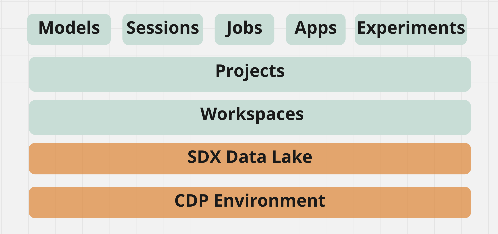
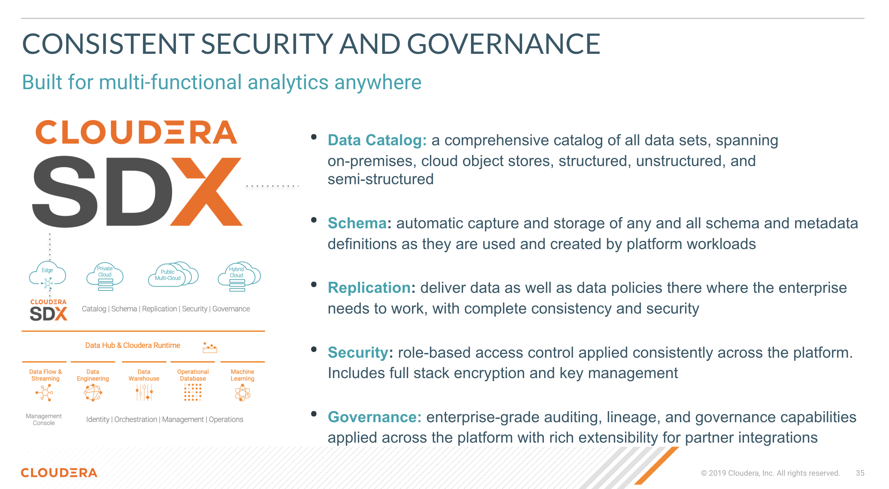

# CML MLops Telco MLFlow

Cloudera Machine Learning (CML) is Cloudera’s cloud-native machine learning platform built for CDP. Cloudera Machine Learning unifies self-service data science and data engineering in a single, portable service as part of an enterprise data cloud for multi-function analytics on data anywhere.

It empowers organizations to build and deploy machine learning and AI capabilities for business at scale, efficiently and securely, anywhere they want. It’s built for the agility and power of cloud computing, but isn’t limited to any one cloud provider or data source.

### CML at a Glance

CML is a comprehensive platform to collaboratively build and deploy machine learning capabilities at scale.

Cloudera Machine Learning provides benefits for each type of user.

##### Data Scientists

* CML Enables DS teams to collaborate and speed model development and delivery with transparent, secure, and governed workflows

* With CML, DS teams can expand AI use cases with automated ML pipelines and an integrated and complete production ML toolkit

* CML enables faster decision making and trust with end-to-end visibility and auditability of data, processes, models, and dashboards

##### IT Teams

* CML increases DS productivity with visibility, security, and governance of the complete ML lifecycle

* It eliminate silos, blindspots, and the need to move/duplicate data with a fully integrated platform across the data lifecycle.

* CML accelerates AI with self-service access and containerized ML workspaces that remove the heavy lifting and get models to production faster

##### Business Users

* CML provides access to interactive Applications built and deployed by DS teams.

* Analysts are empowered with predictive insights to more intelligently make business decisions.

### CML Key Capabilities

Cloudera Machine Learning covers the end-to-end machine learning workflow, enabling fully isolated and containerized workloads - including Python, R, and Spark-on-Kubernetes - for scale-out data engineering and machine learning with seamless distributed dependency management.

* Sessions enable Data Scientists to directly leverage the CPU, memory, and GPU compute available across the workspace, while also being directly connected to the data in the data lake.

* Experiments enable Data Scientists to run multiple variations of model training workloads, tracking the results of each Experiment in order to train the best possible Model.

* Models can be deployed in a matter of clicks, removing any roadblocks to production. They are served as REST endpoints in a high availability manner, with automated lineage building and metric tracking for MLOps purposes.

* Jobs can be used to orchestrate an entire end-to-end automated pipeline, including monitoring for model drift and automatically kicking off model re-training and re-deployment as needed.

* Applications deliver interactive experiences for business users in a matter of clicks. Frameworks such as Flask and Shiny can be used in development of these Applications, while Cloudera Data Visualization is also available as a point-and-click interface for building these experiences.

### Cloudera Data Platform (CDP)

Cloudera Data Platform (CDP) is an enterprise data cloud, which functions as a platform for both IT and the business. It incorporates support for an environment running both on on-premises and in a public cloud setup.

CDP also has multi-cloud and multifunction capabilities at the same time as it’s both simple to use and secure by design. It supports both manual and automated functions and is open and extensible. It offers a common environment for both data engineers and data scientists, supporting data science team collaboration.

The data platform from Cloudera provides self-service access to integrated, multi-function analytics on centrally managed and secured business data while deploying a consistent experience anywhere — on-premises or in hybrid and multi-cloud. This includes consistent data security, governance, lineage, and control, while deploying the efficient, easy-to-use cloud analytics, eliminating end-user need for shadow IT solutions.

* Secure By Design: every bit of the architecture and infrastructure of your platform and application is built with security as a primary consideration.

* Track and Audit Everything: CDP provides centralized lineage across datsets, users, and machine learning models, so enterprises can explain every aspect of the use case lifecycle.

* Aligned Practices across Environments: implementing common and consistent practices for the management of multiple cloud environments result in lower operational costs and enhanced security practices.

